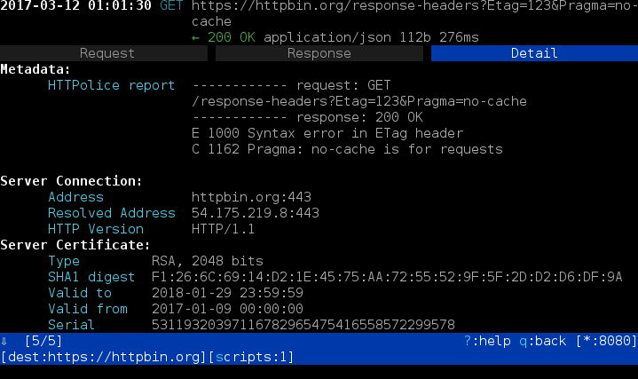
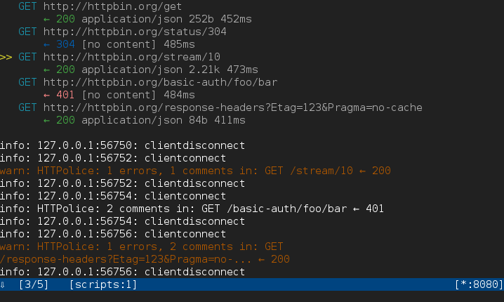

mitmproxy integration for HTTPolice
===================================

.. highlight:: console

`mitmproxy`__ is an advanced HTTP debugging tool
that can intercept TLS-encrypted connections, supports HTTP/2, and much more.

__ https://mitmproxy.org/

mitmproxy-HTTPolice is a `script for mitmproxy`__
that will check intercepted exchanges and produce an `HTTPolice`__ report.
It also works with mitmproxy’s companion tools `mitmdump`__ and `mitmweb`__.

__ http://docs.mitmproxy.org/page/scripting/overview.html
__ http://httpolice.readthedocs.io/
__ http://docs.mitmproxy.org/page/mitmdump.html
__ http://docs.mitmproxy.org/page/mitmweb.html

For recent changes in mitmproxy-HTTPolice, see the `changelog`__.

__ https://github.com/vfaronov/mitmproxy-httpolice/blob/master/CHANGELOG.rst

Installation
------------

Do this in a Python 3.5+ environment::

  $ pip3 install mitmproxy-HTTPolice

If this is giving you trouble,
see `mitmproxy docs`__ and `HTTPolice docs`__ for more detailed instructions.

__ http://docs.mitmproxy.org/page/install.html
__ http://httpolice.readthedocs.io/page/install.html

.. note::

   **Do not use** mitmproxy’s pre-built self-contained binaries.
   mitmproxy and HTTPolice need to live in the same Python environment,
   and this is only possible if you install mitmproxy from source via pip.
   See the “Installation from Source” sections in mitmproxy docs.

Basic usage
-----------
To run HTTPolice together with mitmproxy, use a command like this::

  $ mitmdump -s "`python3 -m mitmproxy_httpolice` -o html -w report.html"

Note the backticks.
Replace ``mitmdump`` with ``mitmproxy`` or ``mitmweb`` as needed.

``-s`` is an option for mitmproxy that specifies a script to run,
along with arguments to that script.

``python3 -m mitmproxy_httpolice`` is a sub-command
that prints the path to the script file::

  $ python3 -m mitmproxy_httpolice
  /home/vasiliy/.local/lib/python3.5/site-packages/mitmproxy_httpolice.py

``-o html`` tells HTTPolice to produce HTML reports
(omit it if you want a plain text report).
Finally, ``-w report.html`` gives the name of the output file.

Now, mitmdump starts up as usual.
Every exchange that it intercepts is checked by HTTPolice.
When you stop mitmdump (Ctrl+C), HTTPolice writes a report to ``report.html``.

Inspecting traffic on the fly
-----------------------------
Often, you don’t want to get one big report at the end:
you want to see a report for every request/response as it arrives.
You can do this with the ``--tail`` option, which tells mitmproxy-HTTPolice
to regenerate the report on every new exchange::

  $ mitmdump -s "`python3 -m mitmproxy_httpolice` -o html -w report.html --tail 5"

With the above command, ``report.html`` will always contain
a report on the **last 5 exchanges** seen by mitmproxy.
The latest exchange is at the **bottom** of the page.

Instead of constantly refreshing that page, you can keep an eye on the log
that mitmdump prints to the console, because HTTPolice will notify you
whenever there’s something to see::

  HTTPolice found 2 errors, 3 comments in: POST /api/v1/customer/ - 201 Created

Integration with the console UI
-------------------------------
When using the `console UI of mitmproxy`__ (the tool named ``mitmproxy``),
you can also see the report for every exchange (“flow” in mitmproxy parlance)
on its “Detail” tab:

__ http://docs.mitmproxy.org/page/mitmproxy.html

How do you even know that there’s anything to see there?
Currently the only way is to follow the event log,
which you can trigger by pressing the ‘e’ key:

When using mitmproxy-HTTPolice like this, you don’t have to specify
an output file. You can simply run::

  $ mitmproxy -s "`python3 -m mitmproxy_httpolice`"

Of course, if you *also* want a fully-fledged report,
you can combine this with the ``-w``, ``-o`` and ``--tail`` options.

More options
------------
You can use the ``-s`` option to :ref:`silence <silence>` unwanted notices,
just as with the ``httpolice`` command-line tool::

  $ mitmdump -s "`python3 -m mitmproxy_httpolice` -s 1089 -s 1194 -w report.txt"

mitmproxy itself has many interesting options.
One of the more useful features is the ability to dump traffic into a file.
If you do this, you can then “replay” it as many times as you wish::

  $ mitmdump --wfile flows.dat
  $ mitmdump --no-server --read-flows flows.dat \
  >     -s "`python3 -m mitmproxy_httpolice` -w /dev/stdout"
