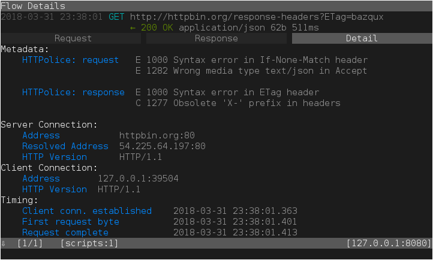
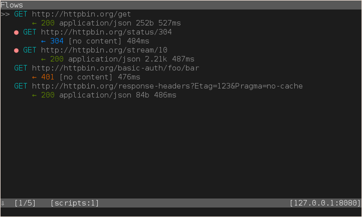

Walkthrough
===========

.. highlight:: console

This walkthrough explains how to use mitmproxy-HTTPolice in various cases,
but it does not explain mitmproxy itself. For best results, familiarize
yourself with mitmproxy and its `docs`__ first.

__ https://docs.mitmproxy.org/stable/

Installation
------------

Do this in a Python 3.6+ environment::

  $ pip3 install mitmproxy-HTTPolice

If this is giving you trouble,
see `mitmproxy docs`__ and `HTTPolice docs`__ for more detailed instructions.

__ https://docs.mitmproxy.org/stable/overview-installation/
__ https://httpolice.readthedocs.io/page/install.html

.. note::

   **Do not use** mitmproxy’s pre-built self-contained binaries.
   mitmproxy and HTTPolice need to live in the same Python environment,
   and this is only possible if you install mitmproxy from source via pip.
   See the “Installation via pip3” sections in mitmproxy docs.

.. _startup:

Startup
-------

Get the path to the mitmproxy-HTTPolice `addon`__ file
with the following command::

  $ python3 -m mitmproxy_httpolice
  /home/vasiliy/.local/lib/python3.6/site-packages/mitmproxy_httpolice.py

__ https://docs.mitmproxy.org/stable/addons-overview/

Tell mitmproxy to load this file with the ``-s`` (``--scripts``) option,
like this (note the backticks)::

  $ mitmproxy -s "`python3 -m mitmproxy_httpolice`"

.. highlight:: yaml

Or just put it into your ``~/.mitmproxy/config.yaml``::

  scripts:
    - /home/vasiliy/.local/lib/python3.6/site-packages/mitmproxy_httpolice.py

.. highlight:: console

Inspecting traffic on the fly
-----------------------------

mitmproxy-HTTPolice checks every flow (:ref:`exchange <exchanges>`)
and prints any results on the flow’s `Details` pane, under `Metadata`:

.. _marking:

Marking flows with problems
---------------------------

From the flow list, how do you know which flows have any interesting notices
on them?

HTTPolice can *mark* them for you if you set the `option`__ ``httpolice_mark``.
There are several ways to set it:

- From inside mitmproxy: with the options editor (by typing ``O``).
  The new value you set there will **only apply to newly captured flows**.

- On the command line::

    $ mitmproxy --set httpolice_mark=comment

  .. highlight:: yaml

- In your ``~/.mitmproxy/config.yaml``::

    httpolice_mark: error

  .. highlight:: console

__ https://docs.mitmproxy.org/stable/concepts-options/

``httpolice_mark=comment`` means “mark any flows where HTTPolice has found
at least one comment or error”. ``httpolice_mark=error`` limits this to errors.

*Marking flows* is a general concept in mitmproxy. Marked flows have
a big fat dot next to them in the flow list:

You can quickly run `commands`__ on “all marked flows”, for instance,
to save them to a file::

  : save.file @marked /path/to/marked.flows

__ https://docs.mitmproxy.org/stable/concepts-commands/

You can also manually toggle the mark on any flow by typing ``m``.

.. _mitmproxy_silence:

Silencing unwanted notices
--------------------------

With the ``httpolice_silence`` option, you can tell HTTPolice which notice IDs
to :ref:`silence <silence>`. They will disappear from flow details, and so on.

When editing this option in mitmproxy’s interactive options editor,
type ``a`` to add a new item, then type the notice ID, then Esc to commit.
Type ``d`` on an item to delete it. The new value you set
will apply to newly captured flows and newly produced reports.

In ``~/.mitmproxy/config.yaml``, notice IDs must be quoted so they are
treated as strings, **not** numbers::

  httpolice_silence:
    - "1234"
    - "1256"

.. _reports:

Full reports
------------

If you prefer to see HTTPolice’s full HTML report, you can create one
with the ``httpolice.report.html`` command. For example::

  : httpolice.report.html @all /path/to/report.html

Here, ``@all`` means “all flows”. You can replace it with any of mitmproxy’s
`filter expressions`__, among them ``@marked`` for flows that have
been previously :ref:`marked <marking>` by HTTPolice.

__ https://docs.mitmproxy.org/stable/concepts-filters/

There’s also the ``httpolice.report.text`` command if you want the plain
text report.

.. _inmemory:

In-memory reports
-----------------

In fact, you don’t have to go through a file to see the report.
You can put a dash (``-``) in place of the filename::

  : httpolice.report.html @all -

The report will be stored in memory, and you can view it by visiting
``/+httpolice/`` *via mitmproxy*. If mitmproxy is running on
``localhost:8080`` in `reverse proxy`__ mode, then just go to
``http://localhost:8080/+httpolice/`` in your Web browser.
When in `regular proxy`__ mode, visit something like
``http://example.com/+httpolice/`` through the proxy
(the domain doesn’t matter, only the path).

__ https://docs.mitmproxy.org/stable/concepts-modes/#reverse-proxy
__ https://docs.mitmproxy.org/stable/concepts-modes/#regular-proxy

.. _keybindings:

Key bindings
------------

Because ``httpolice.report.html`` is a normal mitmproxy command, you can set
`key bindings`__ for it. For example, if you put the following into your
``~/.mitmproxy/keys.yaml``::

  - key: W
    cmd: httpolice.report.html @focus ~/report.html

then typing ``W`` (that is, Shift+W) will produce an HTML report on the currently
focused flow in ``~/report.html``.

__ https://docs.mitmproxy.org/stable/tools-mitmproxy/#key-binding-configuration

Example workflow
----------------

Here’s one workflow that can arise from the features explained so far.

Let’s say you’re a developer (or tester) iterating on a piece of software
that sends or serves HTTP requests, and you want that software to implement
the HTTP protocol correctly.

First, :ref:`set option <marking>` ``httpolice_mark`` to ``comment``,
and :ref:`set a keybinding <keybindings>` like this::

  - key: f5
    cmd: httpolice.report.html @marked -

Then:

#. Do something with your software, capturing a bunch of flows into mitmproxy.

#. In mitmproxy, type F5. HTTPolice produces a report on all the problems
   found so far and stores it in memory.

#. Open (or refresh) ``http://localhost:8080/+httpolice/`` in your Web browser
   (tweak the URL :ref:`as necessary <inmemory>`) to read the report.

#. Fix the problems in your software,
   or :ref:`silence them <mitmproxy_silence>` in HTTPolice.

#. Now that you are done with that particular batch of flows,
   type ``z`` in mitmproxy to clear the flow list.

#. Rinse, repeat.

Non-interactive use
-------------------

mitmproxy-HTTPolice is currently focused on interactive use.
Of mitmproxy’s three `tools`__, only the original ``mitmproxy`` console UI
currently supports HTTPolice. ``mitmweb`` lacks the necessary features,
although it will probably catch up to ``mitmproxy`` eventually.
``mitmdump`` is aimed at non-interactive use and HTTPolice doesn’t do
anything useful under it.

__ https://docs.mitmproxy.org/stable/overview-tools/

That said, you can get data from ``mitmdump`` into HTTPolice like this:

#. Run ``mitmdump`` with the ``--save-stream-file`` option
   to save flows into a file.
#. Run ``mitmproxy`` with the ``--no-server`` and ``--rfile`` options
   to load flows from that file. Of course, you may run it on another system.
#. Work in ``mitmproxy`` as usual (``: httpolice.report.html @all ...``).
