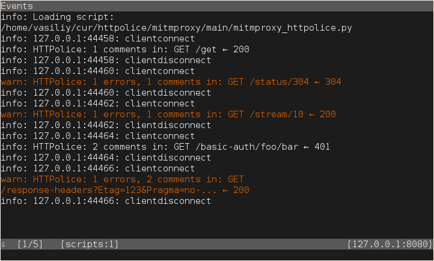

Walkthrough
===========

.. highlight:: console

This walkthrough explains how to use mitmproxy-HTTPolice in various scenarios,
but it does not explain mitmproxy itself. For best results, familiarize
yourself with mitmproxy and its `docs`__ first.

__ https://docs.mitmproxy.org/stable/

Installation
------------

Do this in a Python 3.5+ environment::

  $ pip3 install mitmproxy-HTTPolice

If this is giving you trouble,
see `mitmproxy docs`__ and `HTTPolice docs`__ for more detailed instructions.

__ https://docs.mitmproxy.org/stable/overview-installation/
__ http://httpolice.readthedocs.io/page/install.html

.. note::

   **Do not use** mitmproxy’s pre-built self-contained binaries.
   mitmproxy and HTTPolice need to live in the same Python environment,
   and this is only possible if you install mitmproxy from source via pip.
   See the “Installation via pip3” sections in mitmproxy docs.

.. _startup:

Startup
-------

You need to tell mitmproxy to load the `addon`__ file.

__ https://docs.mitmproxy.org/stable/addons-overview/

For your convenience, after you’ve installed it as per above,
the following command will print the path to the addon file::

  $ python3 -m mitmproxy_httpolice
  /home/vasiliy/.local/lib/python3.5/site-packages/mitmproxy_httpolice.py

So, you can tell mitmproxy to load this file with the ``-s`` (``--scripts``)
option, in a command like this::

  $ mitmproxy -s `python3 -m mitmproxy_httpolice`

.. highlight:: yaml

Or, to avoid typing that every time, just put it into your
``~/.mitmproxy/config.yaml``::

  scripts:
    - /home/vasiliy/.local/lib/python3.5/site-packages/mitmproxy_httpolice.py

.. highlight:: console

Inspecting traffic on the fly
-----------------------------

When you run mitmproxy as shown above, it checks every flow
(:ref:`exchange <exchanges>`) with HTTPolice. You can then find any
resulting notices on the flow’s `Details` pane, under `Metadata`:

.. image:: notices-detail.png

.. _marking:

Marking flows with problems
---------------------------

From the flow list, how do you know which flows have any interesting notices
on them?

HTTPolice can *mark* them for you if you set the `option`__ named
``httpolice_mark``. Like all mitmproxy options, there are several ways
to set it:

- From inside mitmproxy: with the options editor (by typing ``O``).
  The new value you set there will **only apply to newly captured flows**.

  .. note::

     To unset this option in the editor, type ``d`` on it.

- On the command line::

    $ mitmproxy --set httpolice_mark=comment

  .. highlight:: yaml

- In your ``~/.mitmproxy/config.yaml``::

    httpolice_mark: error

  .. highlight:: console

__ https://docs.mitmproxy.org/stable/concepts-options/

So, ``httpolice_mark=comment`` means “mark any flows where HTTPolice has found
at least one comment or error”. ``httpolice_mark=error`` limits this to errors.

*Marking flows* is a general concept in mitmproxy. Marked flows have a big fat
dot next to them in the flows list:

.. image:: marked-flows.png

You can quickly run `commands`__ on “all marked flows”, for instance,
to save them to a file::

  : save.file @marked ~/marked.flows

__ https://docs.mitmproxy.org/stable/concepts-commands/

You can also manually toggle the mark on any flow by typing ``m``.

Event log
---------

Whenever HTTPolice finds a problem in a flow, it also prints a message
to mitmproxy’s event log, which you can inspect by typing ``E``, or, if you
prefer to see it next to the flow list, by typing ``-`` (dash) to change
the UI layout.

.. _mitmproxy_silence:

Silencing unwanted notices
--------------------------

Another option you can change is ``httpolice_silence``, which is a list
of HTTPolice notice IDs that should be :ref:`silenced <silence>`. They will
disappear from the `Details` pane, they will not cause flows to be marked,
and so on.

.. note::

   In ``~/.mitmproxy/config.yaml``, notice IDs must be quoted so they are
   treated as strings, **not** numbers::

     httpolice_silence:
       - "1234"
       - "1256"

   or::

     httpolice_silence: ["1234", "1256"]

.. note::

   Until `mitmproxy issue #3015`__ is fixed, there’s no way to silence
   multiple notices on the command line. Use a config file instead,
   combined with the ``--conf`` option if necessary.

   __ https://github.com/mitmproxy/mitmproxy/issues/3015

.. note::

   When editing this list in mitmproxy’s interactive options editor,
   type ``a`` to add a new item, then Enter to start editing it,
   then type the notice ID, then Esc to commit, and finally ``q`` to close.
   Type ``d`` on an item to delete it.

.. _reports:

Full reports
------------

If you prefer to see HTTPolice’s full HTML report, you can create one
with the ``httpolice.report.html`` command. For example::

  : httpolice.report.html @all ~/report.html

Here, ``@all`` means “all flows”. You can replace it with any of mitmproxy’s
powerful `filter expressions`__, among them ``@marked`` for flows that have
been previously :ref:`marked <marking>` by HTTPolice.

__ https://docs.mitmproxy.org/stable/concepts-filters/

There’s also the ``httpolice.report.text`` command if you want the plain
text report.

Keybindings
-----------

Because ``httpolice.report.html`` is a normal mitmproxy command, you can bind
keyboard shortcuts to it. For example, after the following command,
typing ``W`` (that is, Shift+W) will produce an HTML report on the currently
focused flow in ``~/report.html``::

  : console.key.bind flowlist W httpolice.report.html @focus ~/report.html

.. note::

   .. highlight:: python

   As of this writing, there’s `no easy and well-documented way`__ to make
   keybindings permanent. If you don’t want to bind them every time you
   run mitmproxy, you can write a small custom script to do it for you::
 
     def load(loader):
         from mitmproxy import ctx
         ctx.master.commands.call('console.key.bind flowlist W '
                                  'httpolice.report.html @focus ~/report.html')

   .. highlight:: console

   Put it into a file somewhere, and load that file into mitmproxy
   just as you :ref:`load HTTPolice <startup>` (but **after** HTTPolice,
   e.g. in the **next** ``-s`` option).
 
   __ https://github.com/mitmproxy/mitmproxy/issues/2963

Example workflow
----------------

Here’s an example workflow that can arise from the features explained so far.
Let’s say you’re a developer (or tester) iterating on a piece of software
that sends or serves HTTP requests.

#. Set option ``httpolice_mark`` to ``comment``.

#. Set a keybinding like this::

     : console.key.bind flowlist f5 httpolice.report.html @marked report.html

#. Do something with your software, capturing some flows into mitmproxy.

#. In mitmproxy, type F5. A report on all the problems found by HTTPolice
   is written to ``report.html`` in the current directory.

#. Open that file (or rather, press F5 in a browser window
   where it’s already open) to read the report.

#. Fix the problems in your software,
   or :ref:`silence them <mitmproxy_silence>` in HTTPolice
   by adding them to the ``httpolice_silence`` option.

#. Now that you are done with that particular batch of flows,
   type ``z`` in mitmproxy to clear the flows list.

#. Rinse, repeat.

Companion tools to mitmproxy
----------------------------

``mitmproxy`` is the original tool in a family that now also includes
``mitmdump`` and ``mitmweb``. Unfortunately, for now, HTTPolice’s integration
with them is limited.

You might want to use HTTPolice with ``mitmdump`` if you just want one report
on all of your traffic, without mitmproxy’s interactive UI. But right now
there’s no way to avoid ``mitmproxy`` for this (see `issue #3022`__),
You can run ``mitmdump --save-stream-file``, then run ``mitmproxy --no-server
--rfile`` and :ref:`save a report <reports>` from there,
but at that point why not ditch ``mitmdump`` entirely.
You’re probably going to hit practical limits on HTML report size
well before you have too many flows to fit into mitmproxy’s memory.

__ https://github.com/mitmproxy/mitmproxy/issues/3022

As for ``mitmweb``, it may grow into a fully-featured replacement
for ``mitmproxy`` one day, but right now it doesn’t have commands,
marked flows, nor metadata display, so there’s nothing HTTPolice can hook into.
